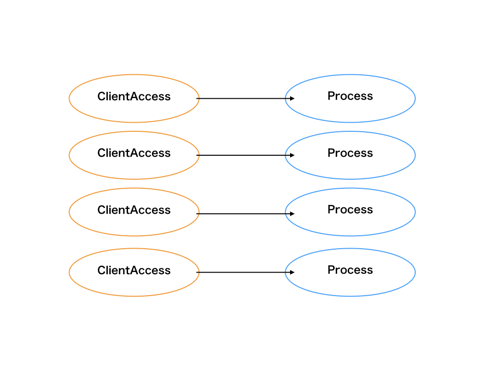

# 用語

## プロセス(Process)

* プログラムの実行単位であり、CPU時間単位で割り振られる。
* 状態(ステート)があり、現在処理中であるRunning状態だったり、実行可能状態であるReady等が存在する。
* CPUがプロセスを実行する場合、そのプロセスが持つメモリデータに対して演算をを行う。
* プロセスはテキストセグメントとデータセグメントからなる構造データをメモリ上に持っている。
  * テキストセグメント
    * プログラムの命令列
  * データセグメント
    * PDA (Processor Data Area)と呼ばれる、プロセッサの情報やプロセス管理用のデータ領域
    * データ領域と呼ばれる、定数等が置かれる静的領域と、通常の変数等が置かれるヒープ領域からなる領域
    * スタック領域と呼ばれる、一時的なデータ保管領域

## スレッド（Thread）

* CPUを利用するための実行単位で、最小処理単位の概念。
* 子プロセスは独自の仮想メモリを割り当てられるため、より軽量な実行単位が求められLinux2.4からつくられた。

## 平行と並列の違い

>システムが複数の動作（処理の流れ）を同時に実行状態(in progress)に保てる機能を備えている場合を 並行(concurrent)と言い、複数の動作を同時に実行できる場合を並列(parallel)と言います。 重要な概念、違いは「実行状態」という点です。

* 並行(concurrent)
  * ある任意時間時で一つの仕事しか行わないが、複数の仕事を切り替えることにより同時に実行すること。
  * 複数の仕事（スレッド）を実行状態として保てている状態。
* 並列（pararell）
  * ある任意時間時で複数の仕事を同時に実行すること。
  * 並列は平行を包含していることに注意。

## シングルプロセスとマルチプロセス（マルチタスク）

* マルチプロセス
  * 複数のプロセスを並列処理すること。
  * クライアントからの接続毎にプロセスをフォークして処理する。
  * プロセスをフォーク（fork）し、子プロセスを複数立ち上げることで同じプログラムを並列実行することができる。
  * プロセス ∋ スレッドの概念であることに注意。
  * メリット
    * メモリ空間が子プロセス毎に独立しているため、スクリプト言語等を組み込みやすい。
  * デメリット
    * メモリ空間が共有できないため、プロセス間のメモリを直接参照できない。

* シングルプロセス
  * そのまま、1つのプロセスでのプログラム実行を示す。
  * プロセスは一つなので、平行処理となる

## シングルスレッドとマルチスレッド

* マルチスレッド
  * 複数のスレッドを並列処理すること
  * 1プロセスの中で各スレッドの並列処理を行うことができるということ。
  * クライアントからの接続毎にスレッドを生成して処理する。
  * メリット
    * メモリ空間が各スレッドの間で共有できる。
    * マルチプロセスモデルに比べ、メモリ空間の切り替えがない分、メモリ消費量やコンテキストスイッチのオーバーヘッドが小さくなる。
  * デメリット
    * メモリ空間を共有しているため、他のスレッドに依存する場合がありスクリプト言語等が組み込めない場合もある。

* シングルスレッド
  * 並行して複数のプログラム流れが実行されるマルチスレッドと対比して、プログラムの処理の流れが一本のみの状態のこと。
  * 並列処理ではなく、単一の命令の流れを逐次的に実行していく平行処理を指す

## コンテキストスイッチ

同時接続数分のプロセスやスレッドが必要になり、その数が多くなるとコンテキストスイッチが発生し処理が遅くなる場合がある。
>コンテキストスイッチとは、コンピュータの処理装置（CPU）が現在実行している処理の流れ（プロセス、スレッド）を一時停止し、別のものに切り替えて実行を再開すること。

## C10K問題

>「C」は「Client(クライアント)」、「10K」は「1万台」を表し、(ハードウェアやネットワーク性能に問題がなくても)同時クライアント接続数がある一定数を超えるとサーバがパンクしてしまう問題のこと。

## アーキテクチャの種類

* MPM（Multi Processing Module）の種類
  * preforkモデル
    * Apacheのデフォルトアーキテクチャで利用されている。
    * マルチプロセスモデル
    * スレッドを使わず、先行してforkを行なうwebサーバを指す
    * リクエストとプロセスが1対1対応で処理する。
    * メリット
      * 子プロセスが何らかの原因で停止しても、他の子プロセスには影響を及ぼすことが無く通信を継続できるため、安定した通信を行える。
    * デメリット
      * 同時接続数（クライアント数）に比例して子プロセスの数も増えるので、使用メモリ量やCPU負荷が比例的に増大していくことになり、C10K問題に繋がる。
  

  * workerモデル
    * Apacheのアーキテクチャとして利用可能。
    * マルチプロセスとマルチスレッドのハイブリッド型モデル。
    * Apacheの子プロセス1つ1つがマルチスレッドで動作し、スレッド1つが1つのクライアントの処理を担う。
    * リクエストとスレッドが1対1対応で処理する。
    * メリット
      * 多くの子プロセスを起動せずに、メモリの使用量を減らすことができる。
    * デメリット
      * 同時接続数（クライアント数）に比例してスレッドの数も増えるので、使用メモリ量やCPU負荷が比例的に増大していくことになり、C10K問題に繋がる。
  

  * イベント駆動モデル(event)
    * Nginxのアーキテクチャで利用されている。(apache 2.4からデフォルトに設定する)
    * イベント駆動型モデルとは、クライアントのアクセスをイベントとして扱い、それをトリガーにプロセス内で処理を行うこと。
    * 1プロセスは1スレッドしか利用しないので、CPUの数だけプロセスを用意するワーカーモデルが利用されている。
    * メリット
      * シングルスレッドのプロセスのためメモリ空間の共有が可能。
      * 同時接続数（クライアント数）が増えても、プロセス数やスレッド数は増えないため、C10K問題を解決できる。
      * そのため、メモリ消費量やコンテキススイッチのオーバーヘッドが小さい。
    * デメリット
      * メモリ空間を共有しているため、他のスレッドに依存する場合がありスクリプト言語等が組み込めない場合もある。