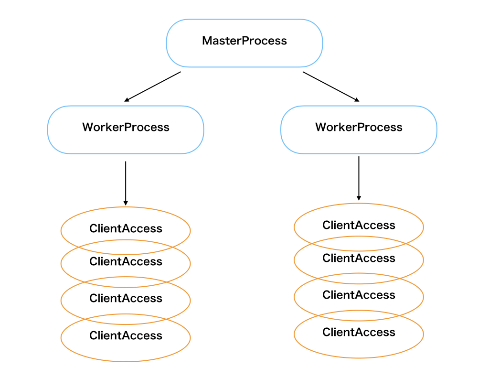

# Nginxのアーキテクチャ

## イベント駆動による非同期的なI/Oによるアーキテクチャ

接続ごとにプロセスやスレッドを立ち上げてコンテキストスイッチが起こらないように、Nginxはシングルスレッドで処理を行う。

## プロセスの仕組み

* マスタープロセス
  * workerプロセスの立ち上げや管理を担い、nginx全体のプロセスを制御する
* ワーカープロセス
  * workerと呼ばれるシングルスレッドのプロセスが、それぞれ複数のリクエストを処理する。
  * つまり、1つのworkerプロセスが、複数のリクエストを処理する。
  * ただしワーカプロセス自体はマルチプロセスとして扱うことも可能。各ワーカプロセスはマスタプロセスが受信したシグナルの種類に応じて各ワーカプロセスにもシグナルを送る。
  
**1プロセスで多数のクライアントの接続を処理するためにはマルチプロセス, マルチスレッド, 非同期I/O, I/Oの多重化という方法がある。**

## NginxでのI/O処理

* （イベントループによる）非同期なイベント駆動と、IOの多重化によって、workerプロセスにてリクエストが完全に処理されることを待たずに処理を捌くことができている。

## Nginxはリバースプロキシとしても利用できる

* 一般的なプロキシ
  * クライアントからプロキシサーバに、任意のWebサーバへのリクエストを行う。
* リバースプロキシ
  * Webサーバーの代理の役割を行う。
  * Webサーバーへのリクエストの代理受信や、クライアントへのレスポンスの代理送信ができる。

### リバースプロキシのメリット

* キャッシュや圧縮による高速化
  * リバースプロキシにてデータのキャッシングや圧縮をすることが可能。
  * 同じページへアクセスがあった時は外部のサーバへアクセスを行わずに済むため、応答性能の向上や通信量の削減になる
* セキュリティの向上
  * IPアドレスでのフィルタリングにより、悪意のあるホストからのリクエストの遮断や特定のIPのみ許可することができる。
  * webサーバは直接インターネットに接する必要がないためリスクが低減する。
  * リバースプロキシ上でファイアウォールなどのセキュリティ対策をすることで、Webサーバに直接手を加えることなく安全性を高めることができる。
* SSLの集中管理
  * クライアントとリバースプロキシ間の通信路がSSLで暗号化される場合、リバースプロキシが通信内容を復号することで
  * 通信するWebサーバー自体をそれぞれHTTPSに対応させることなく、通信路を暗号化することが可能。
* 負荷分散
  * webサーバは複数台で構成され、1台のリバースプロキシサーバから複数のWebサーバにリクエストを振り分け負荷分散が可能。
  * また、リバースプロキシでURLを分解してからURLを変換しWEBサーバーに転送ができ、URLの短縮も行うことができる。
* メモリ効率の向上
  * URLから静的コンテンツ/動的コンテンツを各サーバーに振り分けて処理を行うことができ、全体としてメモリ使用効率が上がる。

## Apacheとの比較

### Nginxを選択する場合

* 負荷が高く、スケーラビリティが要求されるような場合。
* 静的ページに同時多数のアクセスが想定されるような場合。

### Apacheを選択する場合

* 負荷が低く、早期または簡易的なセットアップが必要な場合。
* 同時アクセス数が小さく、単純にリクエスト数が多いような場合。
  
[ApacheとNginxについて比較](https://qiita.com/kamihork/items/49e2a363da7d840a4149)

[Nginxのアーキテクチャについて](https://qiita.com/kamihork/items/296ee689a8d48c2bebcd)