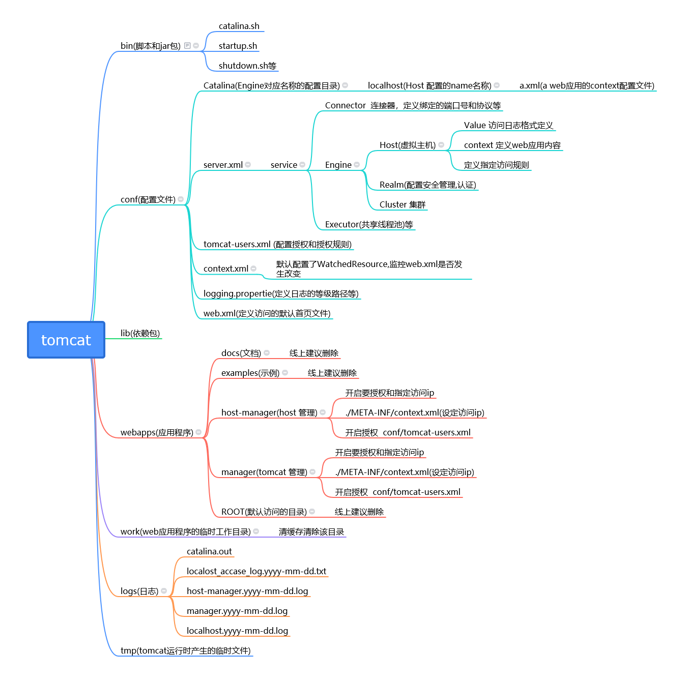
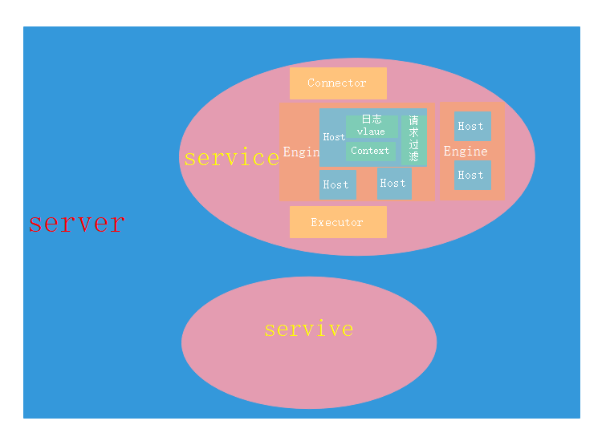

# tomcat server.xml

## tomcat 结构图

## server.xml 结构图

## 核心组件

- Server
  - Server元素在最顶层，代表整个Tomcat容器，因此它必须是server.xml中唯一一个最外层的元素。
  - 一个Server元素中可以有一个或多个Service元素。
  - Server的主要任务
    - 提供一个接口让客户端能够访问到这个Service集合，同时维护它所包含的所有的Service的声明周期，包括如何初始化、如何结束服务、如何找到客户端要访问的Service。
- Service
  - Service的作用
    - 是在Connector和Engine外面包了一层，把它们组装在一起，对外提供服务。
  - 一个Service可以包含多个Connector，但是只能包含一个Engine
    - Connector的作用是从客户端接收请求，
    - Engine的作用是处理接收进来的请求。
- Connector
  - 主要功能
    - 是接收连接请求，创建Request和Response对象用于和请求端交换数据；
    - 然后分配线程让Engine来处理这个请求，并把产生的Request和Response对象传给Engine。
- Engine
  - Engine组件在Service组件中有且只有一个
  - Engine是Service组件中的请求处理组件
  - Engine组件从一个或多个Connector中接收请求并处理，并将完成的响应返回给Connector，最终传递给客户端。
  - Engine、Host和Context都是容器
    - 关系：Engine包含Host，Host包含Context。
- Host
  - Engine与Host
    - Host是Engine的子容器。Engine组件中可以内嵌1个或多个Host组件，每个Host组件代表Engine中的一个虚拟主机
    - Host组件至少有一个，且其中一个的name必须与Engine组件的defaultHost属性相匹配。
    - Host的作用
      - Host虚拟主机的作用，是运行多个Web应用（一个Context代表一个Web应用），并负责安装、展开、启动和结束每个Web应用。
- Context
  - Context的作用
    - Context元素代表在特定虚拟主机上运行的一个Web应用。

## Web应用自动部署

- Host的配置
  - 配置的方式
    - Host元素的deployOnStartup和autoDeploy属性
  - 区别
    - deployOnStartup为true时，Tomcat在启动时检查Web应用，且检测到的所有Web应用视作新应用
    - autoDeploy为true时，Tomcat在运行时定期检查新的Web应用或Web应用的更新
    - 除此之外，二者的处理相似。
  - 检查Web应用更新
    - Tomcat按照如下的顺序进行扫描，来检查应用更新：
      - 扫描虚拟主机指定的xmlBase下的XML配置文件
      - 扫描虚拟主机指定的appBase下的WAR文件
      - 扫描虚拟主机指定的appBase下的应用目录

## 核心组件的关联

- 如何确定请求由谁处理
  - 根据协议和端口号选定Service和Engine
  - 根据域名或IP地址选定Host
  - 根据URI选定Context/Web应用

## 其他组件

- Listener
  - Listener(即监听器)定义的组件，可以在特定事件发生时执行特定的操作；
  - 被监听的事件通常是Tomcat的启动和停止。
  - 监听器可以在Server、Engine、Host或Context中
  - 默认配置的监听器：
    - VersionLoggerListener
      - 当Tomcat启动时，该监听器记录Tomcat、Java和操作系统的信息。该监听器必须是配置的第一个监听器。
    - AprLifecycleListener
      - Tomcat启动时，检查APR库，如果存在则加载。APR，即Apache Portable Runtime，是Apache可移植运行库，可以实现高可扩展性、高性能，以及与本地服务器技术更好的集成。
    - JasperListener
      - 在Web应用启动之前初始化Jasper，Jasper是JSP引擎，把JVM不认识的JSP文件解析成java文件，然后编译成class文件供JVM使用。
    - JreMemoryLeakPreventionListener
      - 与类加载器导致的内存泄露有关
    - GlobalResourcesLifecycleListener
      - 通过该监听器，初始化\<GlobalNamingResources\>标签中定义的全局JNDI资源；如果没有该监听器，任何全局资源都不能使用
    - ThreadLocalLeakPreventionListener
      - 当Web应用因thread-local导致的内存泄露而要停止时，该监听器会触发线程池中线程的更新。当线程执行完任务被收回线程池时，活跃线程会一个一个的更新
      - 只有当Web应用(即Context元素)的renewThreadsWhenStoppingContext属性设置为true时，该监听器才有效。
- GlobalNamingResources与Realm
  - Realm
    - Realm提供了一种用户密码与web应用的映射关系，从而达到角色安全管理的作用
    - GlobalNamingResources元素定义了全局资源，
- Valve
  - Tomcat中代表了请求处理流水线上的一个组件
  - 不同的Valve有不同的特性
  - AccessLogValve
    - AccessLogValve的作用是通过日志记录其所在的容器中处理的所有请求
    - pattern
      - %h：远程主机名或IP地址；如果有nginx等反向代理服务器进行请求分发，该主机名/IP地址代表的是nginx，否则代表的是客户端。后面远程的含义与之类似，不再解释。
      - %l：远程逻辑用户名，一律是”-”，可以忽略。
      - %u：授权的远程用户名，如果没有，则是”-”。
      - %t：访问的时间。
      - %r：请求的第一行，即请求方法(get/post等)、uri、及协议。
      - %s：响应状态，200,404等等。
      - %b：响应的数据量，不包括请求头，如果为0，则是””-。
